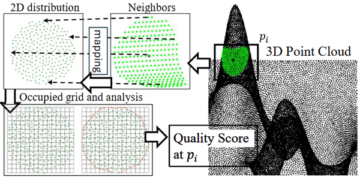

# Pointcloud Quality Assessment

This is the official repository for our proposed PCQA method, which can be integrated into industrial 3D automatic scanning, providing detailed quality scores for acquired point clouds.

Paper link: [here](https://doi.org/10.1016/j.rcim.2024.102863)

## Principle

A subset of the scanned points is mapped onto a 2D distribution based on designated distance and angular values. The quality of the point cloud is then estimated from this 2D distribution. The calculation of the quality score for the points is presented as follows:

<!--  -->
<p align = "center">
    
</p>

## Run a demo

We recommend using Anaconda to create the environment. You can build the environment by:

``` python
conda create -n "PCQA" python=3.8 ipython
conda activate PCQA

pip install -r requirements.txt
# you can install torch based on your CUDA version
pip install torch torchvision torchaudio --index-url https://download.pytorch.org/whl/cu124
```

We would like to thank [DeepFit](https://github.com/sitzikbs/DeepFit). Some parts of our implementation are based on their excellent work.

1. Run

    You can jump into the `./src` folder, and run

    ``` shell
    python n-jet_fitting.py
    ```

    where the default order (\$**jet_order_fit**) for n-jet is 3, and K size (\$**points_per_patch**) is 256. A fitting result file is outputed in `./src/data` folder named "sample_order3_normal_beta.txt".

2. Calculate the Quality Score

    ``` shell
    python pcqa_demo.py -tn 14 -sn 8
    ```

    where `-tn` denotes `thread_number` and `-sn` is `skip_number`. The smaller the `skip_number`, the slower the algorithm runs.

3. [optional] Calculate the Quality Score in Jupyter Notebook

    Install the kernel for Jupyter notebook

    ``` shell
    ipython kernel install --name "PCQA" --user
    jupyter notebook
    ```

    You can open `QualityScoreEstimation.ipynb` to have a better understanding.

4. Visualization

    A quality score file can be found in folder `./src/data/sample_quality_score_ours.txt`. You can use code in `./src/quality2color.py` to covert it to points with colors.

    Additionally, the software [CloudCompare](https://www.danielgm.net/cc/) can be used to visualize it, as shown below

    <p align = "center">
        
    </p>

## Citation & Contact

If you find this work helpful, please consider citing us
```
@article{LI2025102863,
title = {A robust assessment method of point cloud quality for enhancing 3D robotic scanning},
journal = {Robotics and Computer-Integrated Manufacturing},
volume = {92},
pages = {102863},
year = {2025},
issn = {0736-5845},
author = {Leihui Li and Xuping Zhang},
}
```
For any questions about this project, feel free to contact me at `leihui@mpe.au.dk` or open an issue in this repository.
